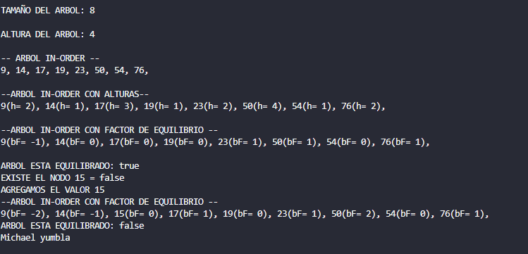

# Práctica de Arbol Binario Atributos

## 📌 Información General

- **Título:** Práctica de Arbol Binario Atributos
- **Asignatura:** Estructura de Datos
- **Carrera:** Computación
- **Estudiante:** Michael Yumbla
- **Fecha:** 19/06/2025
- **Profesor:** Ing. Pablo Torres


---

## 🚀 Ejecución

Para ejecutar el proyecto:

1. Compila el código:
    ```bash
    javac App.java
    ```
2. Ejecuta la aplicación:
    ```bash
    java App
    ```

---

## 🧑‍💻 Ejemplo de Entrada

```plaintext
Seleccione el método de ordenamiento:
1. Burbuja
2. Selección
3. Inserción
4. Burbuja Mejorado
5. Salir

¿Desea ver los pasos? (true/false):
true

¿Desea ordenar ascendentemente (A) o descendentemente (D)?:
A
```
## Imagen 


---

